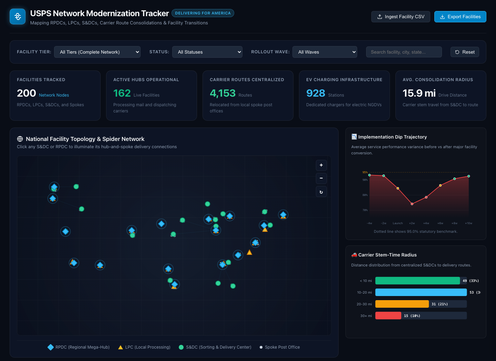

# USPS Network Modernization Tracker (Delivering for America)

An interactive geospatial and operational analytics application monitoring the physical reorganization of the U.S. Postal Service processing, sorting, and delivery infrastructure under the 10-year **Delivering for America (DFA)** plan.



---

## 📌 Background & Context

Under the Delivering for America plan, the Postal Service is transitioning from legacy point-to-point networks to a centralized hub-and-spoke processing and delivery architecture:

* **RPDCs (Regional Processing & Distribution Centers):** ~60 national mega-plants (typically 600,000 to 1.3M+ sq ft) handling all originating mail, package processing, and regional dispatch.
* **LPCs (Local Processing Centers):** ~180-190 facilities dedicated to sorting destinating letters and flats directly to delivery routes.
* **S&DCs (Sorting and Delivery Centers):** ~400 planned large carrier delivery hubs that centralize letter carriers previously stationed at 4 to 10 surrounding historic local post offices ("Spoke Post Offices").
* **Fleet Modernization:** S&DCs are the primary staging grounds for electric vehicle charging infrastructure to support the Next Generation Delivery Vehicle (NGDV) fleet.
* **Service Impact:** Facility transitions have often led to significant temporary delivery disruptions during initial launch waves (the "Implementation Dip") before operational stabilization.

---

## 🚀 Quickstart Guide

### Option 1: Python HTTP Server (Recommended)
From this directory, run:
```bash
python3 serve.py
```
Then navigate to:
```
http://localhost:8085
```

### Option 2: Direct Browser Launch
Open `index.html` directly in any modern browser. Zero build steps, package managers, or external compilers are required.

---

## 🌟 Key Application Features

* **Interactive Network Map & Spider Links**:
  * High-performance visualizer rendering facility nodes by tier with distinct geometric markers:
    * 🔷 **RPDC:** Cyan diamond with glowing radar pulse
    * 🔶 **LPC:** Amber triangle
    * 🟢 **S&DC:** Emerald circle
    * ⚪ **Spoke:** Slate feeder node
  * **Hub-and-Spoke Spider Vectors:** Clicking any S&DC or RPDC illuminates its radial connection lines directly to all affiliated spoke stations!
* **Transition Disruption Curve (The "Implementation Dip")**:
  * Visualizes local delivery performance 8 weeks before activation, through the initial launch plunge (-15% to -20%), and across the 12-week recovery trajectory vs. the 95.0% federal standard.
* **Carrier Stem-Time & Radius Analysis**:
  * Quantifies the commuting distance from centralized S&DCs to delivery territories (<10 mi, 10–20 mi, 20–30 mi, 30+ mi) and the resulting impact on carrier drive times.
* **Slide-out Facility Inspector Profile**:
  * Deep-dive drilldown displaying square footage, EV charging stations, launch waves, child spoke post offices, and regulatory/audit notes.
* **Multi-Tier Filtering & Live Search**:
  * Filter by Tier (RPDC, LPC, S&DC, Spoke), Status (Operational, In Progress, Paused), and Rollout Wave (Wave 1 to Wave 8).
* **Live CSV Ingestion Engine**:
  * Drag-and-drop custom or updated `.csv` facility files to visualize future S&DC activation waves in real time.

---

## 📂 Project Structure

```
usps-dfa-tracker/
├── index.html                   # Semantic HTML5 dashboard container
├── css/
│   └── styles.css               # Operations center dark-mode theme & animations
├── js/
│   ├── app.js                   # Application coordinator & event dispatcher
│   ├── network_map.js           # Interactive Canvas/SVG spatial map & spider lines
│   ├── charts.js                # Transition disruption & stem-time visualizers
│   ├── facility_inspector.js    # Slide-out facility drilldown drawer
│   └── data_loader.js           # Facilities manager, KPI engine & CSV importer
├── data/
│   ├── facilities.json          # Curated database of 200 DFA facilities & 183 links
│   ├── facilities.csv           # Exportable CSV matching federal filings
│   └── generate_dfa_data.py     # Deterministic dataset generator
├── serve.py                     # Local HTTP server script
├── test_tracker.py              # Automated test suite
└── README.md                    # Project documentation
```
